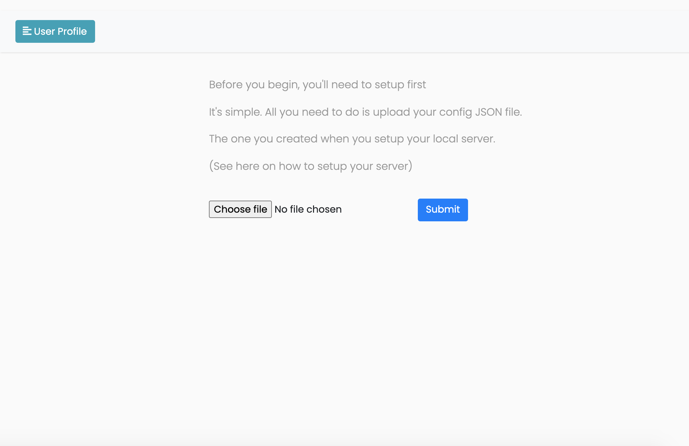
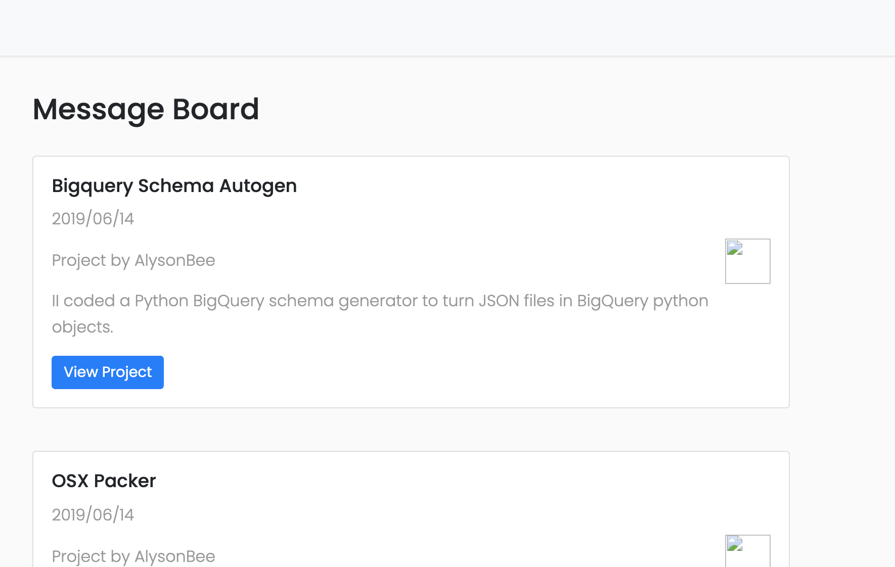

# TerminalStream
Using a remote shell to demo termimnal app Github projects for those interested in showing off their work (sort of the same way ngrok allows for website demos without the user having to clone the server or run it locally).

The shell used in the browser makes use of the XTermJS library while the remote shell that hosts the terminal project is a rework of my old 42 Minishell project

## Getting Start Locally
Before initializing the local servers for each of your projects, you'll have to configure the `config.json` file with your projects specs in the following JSON format
```
{
	"url": "127.0.0.1", # The address of the webserver that users will be able to visit to try your stuff
	"author": "AlysonBee", # The owner of the targeted repo
	"Bigquery_Schema_Autogen": { # the first project URL and the port you want to expose for it
	    "link": "https://github.com/AlysonBee/Python_BigQuery_Schema_Autogen",
	    "port": 4242
	},
	"OSX_Packer": { # the second project URL and the port to expose for it
	    "link": "https://github.com/AlysonBee/OSX_Packer",
	    "port": 5555
	}
  ...
}
```
You can add as many projects as you want with the key being the name of the project with its values following the same paradigm as shown above.

Once you've set up your `config.json` file, all that's left to do is host your projects with a simple
```
python3 init.py activate
```
And that's it for a local setup.

##The Webserver
All you have to do is ensure that the webserver is running at the same url as the one specified in your `url` variable in your config file, then simply run
```
python3 app.py
```
And visit the URL.


On your first ever visit (with a clean database of course) you'll be greeted with this page.
All you need to do is upload the same `config.json` file you created in the previous step and that's it. Your projects will appear as a list on the next page.

Click on "View" project and try it out.

## Next Steps
- The shell hosted locally is completely insecure and needs to be extensively customized to prevent users from having remote access to your entire filesystem. This is just a demo.
- The website needs a lot of work (a looooooot of work). It's recycled from an old version but this functionality is relatively okay.
- I think that's about it. Cheers

### AlysonBee


